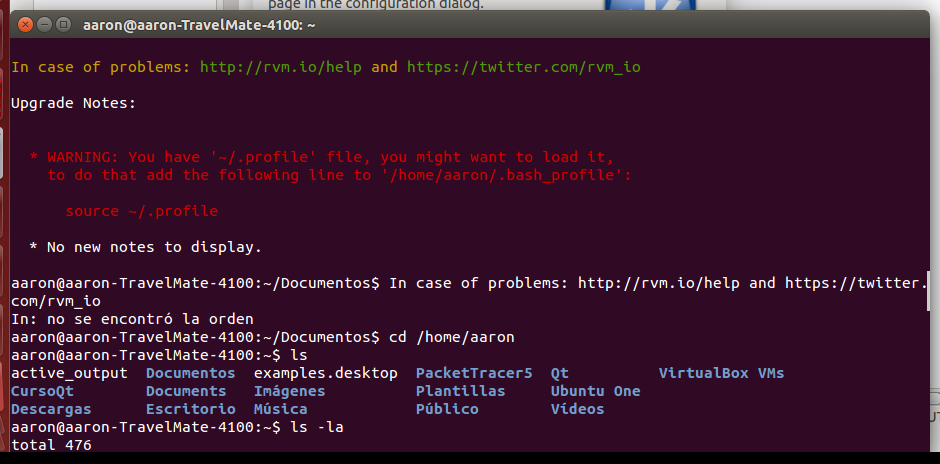
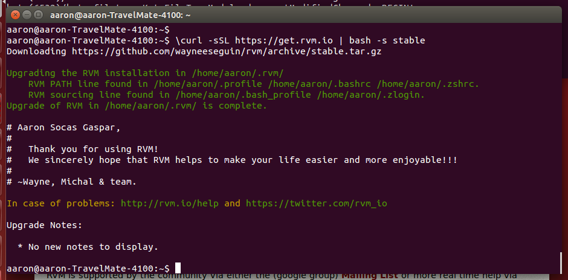
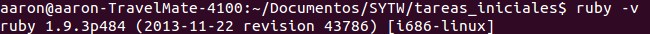
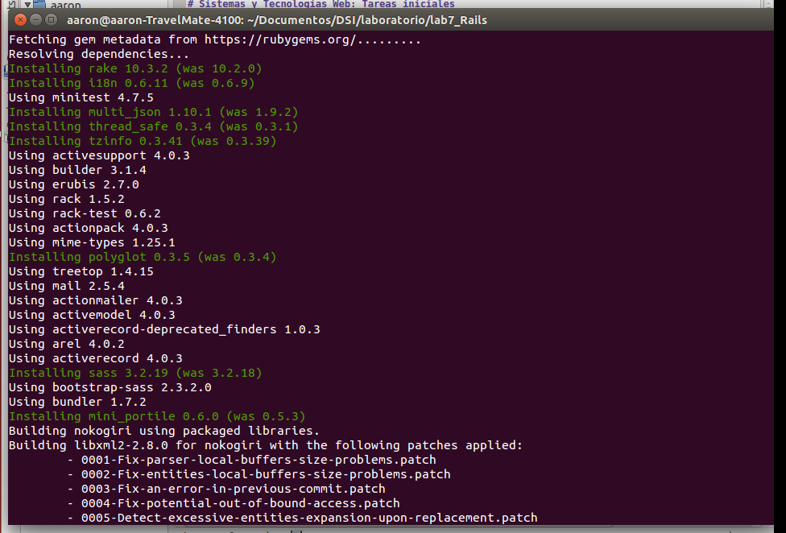
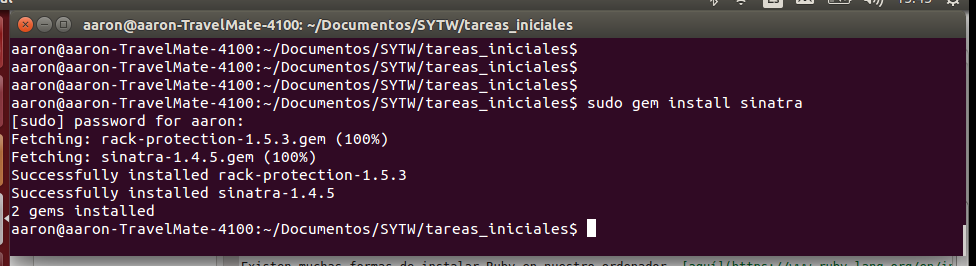
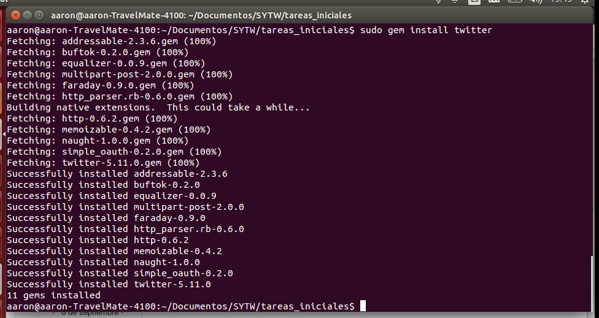
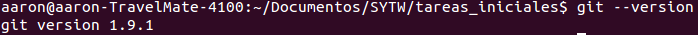

# Sistemas y Tecnologías Web: Tareas iniciales

**Autor: Aarón Socas Gaspar**

## Instalación de RVM

En mi caso he elegido la opción de RVM, aunque ya lo tenía instalado porque lo he usado en otras asignaturas.
Sin embargo, para instalarlo accedemos a este [enlace](https://rvm.io/) .

Allí seguimos las instrucciones de instalación. Es muy importante no ejecutar el comando de instalación como root o administrador:

`
$\curl -sSL https://get.rvm.io | bash -s stable
`

Me encontré con un problema sobre el archivo profile pero que pude resolver, a continuación se muestran las capturas de pantalla:

Seguimos las instrucciones, editamos nuestro bash y solucionado:

## Ruby

Ya tengo instalado ruby en mi equipo:

Para instalarlo en Linux (Debian/Ubuntu):

`
$sudo apt-get install ruby
`

Existen muchas formas de instalar Ruby en nuestro ordenador, [aquí](https://www.ruby-lang.org/en/installation/) se explican varias de ellas.

## bundler

Comprobemos que el comando `bundler` funciona, para ello debemos acceder a alguna carpeta donde tengamos gemas. En mi caso accedo a proyectos donde ya las he utilizado.
Es importante definir correctamente la versión de ruby en nuestro _Gemfile_ .

## Gemas: sinatra, twitter

### sinatra
`
$sudo gem install sinatra
`

### twitter
`
$sudo gem install twitter
`

## Git

Ya tengo instalado el git en mi equipo. Comprobamos la versión:

Para instalar el git en Linux (Debian/Ubuntu): 
`
$apt-get install git
` 

Podemos obtener ayuda para la instalacion [aqui](https://help.github.com/articles/set-up-git) .

## Recursos

- http://kramdown.gettalong.org
- http://makandracards.com/makandra/6683-markdown-kramdown-examples
- https://www.ruby-lang.org/es/downloads/
- https://github.com/
- https://guides.github.com/features/mastering-markdown/

*Aarón Socas Gaspar - Sistemas y Tecnologías Web (Curso 2014-2015)*
